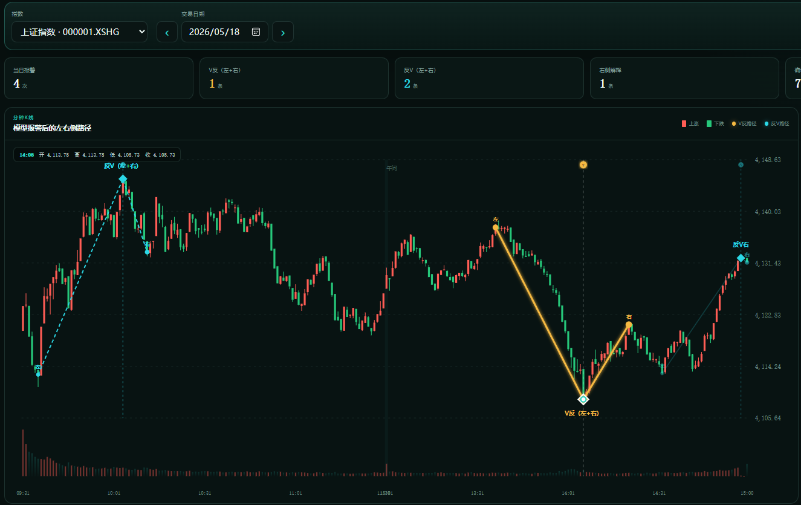

# 演示

# 分钟模型左右侧观察台

页面读取 `D:\V-Right\outputs\all_train` 中三个指数的六个 5 分钟 LightGBM 模型，并使用 `D:\V-Right\reports\strict_events.csv` 判断报警后的严格形态是否成立。

- 报警后 5 分钟内出现同方向严格拐点：短期 `V反（左+右）` / `反V（左+右）`。
- 报警后 6～30 分钟出现同方向严格拐点：长期 `V反（左+右）` / `反V（左+右）`。
- 形态端点以拐点为中心寻找：V反取左右各 30 分钟内的最高收盘点，反V取左右各 30 分钟内的最低收盘点。
- 30 分钟内没有严格事件：仍按上述端点规则绘制候选极值后的 `V反右` / `反V右`。
- 所有匹配均不跨午休；严格事件确认沿用项目离线标签，右侧观察只是报警后的价格路径解释，不等同于严格事件成立。

## 严格事件判定方法

严格事件完全按收盘价序列离线定义，上午和下午分别计算，任何左右臂都不能跨越午休或交易日边界。V反与反V使用相同约束，仅方向相反。

### 1. 每日自适应振幅阈值

先在上午、下午各自连续的分钟序列内计算一分钟对数收益率，避免把午休缺口当成一分钟收益；再按交易日计算一分钟收益率标准差。当天使用的波动率是此前 20 个交易日每日标准差的中位数，整体后移一天，因此不读取当天或未来波动率：

```text
sigma_20d(D) = median(daily_sigma(D-20), ..., daily_sigma(D-1))
threshold(D) = max(0.10%, 2 × sqrt(10) × sigma_20d(D))
```

历史不足 20 个交易日时阈值不可用，不定义严格事件。

### 2. 候选拐点

- V反：当前分钟收盘价必须是前后各 2 分钟、共 5 分钟窗口内的局部最低值。
- 反V：当前分钟收盘价必须是同一窗口内的局部最高值。
- 相等极值也允许成为候选，随后仍需通过左右臂和去重约束。

局部极值使用了拐点之后 2 分钟，只服务于离线事件标签和事后确认，但两根分K的误差范围内能找到极值区域有一定报警预测性

### 3. 左右臂

在候选拐点左右分别搜索 3～20 分钟的端点组合。设拐点价格为 `P`：

```text
V反左振幅 = (左端价格 - P) / P
V反右振幅 = (右端价格 - P) / P

反V左振幅 = (P - 左端价格) / P
反V右振幅 = (P - 右端价格) / P
```

左右振幅都必须不低于当天的自适应阈值。

### 4. 路径效率

每条臂的路径效率定义为端点净变化除以逐分钟绝对变化之和：

```text
路径效率 = abs(终点价格 - 起点价格) / sum(abs(相邻分钟价格变化))
```

左右路径效率都必须达到 `0.55`。数值越接近 1，说明路径越直接；来回震荡越多，效率越低。

### 5. 振幅对称度

```text
振幅对称度 = min(左振幅, 右振幅) / max(左振幅, 右振幅)
```

对称度必须达到 `0.35`，避免只有一侧显著、另一侧过弱的形态被定义为完整 V反或反V。

### 6. 组合选择和8分钟去重

一个拐点可能存在多组满足条件的左右臂，程序按以下事件强度选择最优组合：

```text
事件强度 = min(左振幅, 右振幅) / threshold
         × sqrt(左效率 × 右效率)
         × 振幅对称度
```

强度相同时优先选择右臂更短、确认更早的组合。随后在同一指数、同一上午或下午、同一方向内执行 8 分钟 NMS：优先保留强度更高的事件，与已保留拐点距离不超过 8 分钟的同方向候选会被删除。

### 7. 成立时间与界面线段的区别

严格事件的拐点时间是局部极值所在分钟；事件只有在选中右臂走完后才得到完整确认，确认时间为 `拐点时间 + 右臂分钟数`。

界面为了直观展示，使用拐点左右各 30 分钟内的高低点绘制线段。这个 30 分钟绘图规则不是严格事件定义：严格事件左右臂仍然只能是 3～20 分钟，并且必须同时满足振幅、路径效率、对称度和 NMS 条件。因此界面看起来像 V，并不代表它一定属于严格事件。

双击 `start_live.bat` 启动。模型、行情或严格事件更新后，双击 `refresh_live_data.bat` 重建页面数据。

### 8. 关于连续报警与分钟级极值预测的公开研究参考

模型按分钟更新预测概率，因此同一段行情可能连续或多次触发同方向报警。这些报警对应不同分钟下、基于新增市场信息形成的独立判断，并不要求一个严格极值只能对应一次报警。项目通过 8 分钟冷却机制限制报警密度；事件级统计中，同一个严格事件只计算一次是否被覆盖，报警级统计中则保留每次报警，用于观察概率曲线与价格路径的一致性、报警频率和误报情况。

分钟级极值预测属于低基率且时点敏感的任务，其结果高度依赖极值定义、预测周期、匹配窗口、报警阈值以及重复报警处理方法。目前没有发现头部量化机构公开披露口径一致、可审计的“分钟K线高低点预测准确率”，因此本项目不采用未经证实的行业准确率作为比较基准。

公开研究可以提供以下近似参考，但其任务与本项目并不完全相同：

Sokolovsky 与 Arnaboldi 使用 S&P 500 E-mini 期货逐笔市场微观结构数据，对已提取的价格极值或价格水平进行“反弹或突破”分类。在不同合约和反弹幅度定义下，模型 Precision 约为 15%～25%，F1 约为 11%～32%，ROC-AUC 约为 0.50～0.56。该研究说明，即使使用逐笔成交和市场微观结构特征，极值相关分类仍然具有较高噪声，但该任务是在价格到达候选水平后判断反弹或突破，并非提前预测未来分钟极值，不能与本项目直接比较。
Mesfin 使用 2021—2025 年 Micro E-mini Nasdaq 100 期货五分钟 OHLCV 数据，以扩展窗口方式进行样本外方向预测。不同梯度提升模型的综合样本外准确率约为 50.00%～50.89%，LSTM 为 50.59%，均未显著超过 51.8% 的样本基准率。该研究预测的是较长时段后的方向，不是局部高低点，但说明仅依靠单一品种五分钟 OHLCV 数据获得稳定样本外优势并不容易。
另一项针对同一品种五分钟 OHLCV 数据的研究，在 2021—2025 年间测试了 14 类盘中信号，包括开盘区间突破、缺口、成交量、跨时段动量和波动状态信号。在考虑样本外稳定性、交易成本、最小样本量和统计显著性后，没有任何一类信号同时满足全部标准。该结果表明，分钟级可见价格形态即使存在微弱毛收益，也可能因市场漂移、交易摩擦和年度不稳定而难以形成持续优势。

因此，本项目不以逐分钟判断达到百分之百准确为目标，也不使用其他研究中定义不同的准确率直接证明模型优劣。模型效果应在固定且公开的自身口径下评价，主要包括：

报警 Precision；
每个指数交易日的误报次数；
严格事件业务窗口召回率；
首次报警相对严格极值点的分钟偏移；
同一事件对应的报警次数；
不同年份及后续未参与训练数据上的稳定性。

业务窗口事件召回率正式定义为：同方向报警在严格极值点前 5 个交易分钟至后 5 个交易分钟，即 [-5,+5] 内出现，则认为该严格事件被识别。其中，极值点之前的报警属于提前预测，极值点当分钟及之后 1～5 分钟的报警属于快速转折识别，两者应在需要时分别统计，避免将事后快速识别全部表述为提前预测。

参考论文：

Artur Sokolovsky, Luca Arnaboldi, A Generic Methodology for the Statistically Uniform & Comparable Evaluation of Automated Trading Platform Components, arXiv:2009.09993：
https://arxiv.org/abs/2009.09993
Mathias Mesfin, Sequential Structure in Intraday Futures Data: LSTM vs Gradient Boosting on MNQ, arXiv:2605.17724：
https://arxiv.org/abs/2605.17724
Mathias Mesfin, Structural Limits of OHLCV-Based Intraday Signals in MNQ Futures: A Systematic Falsification Study, arXiv:2605.04004：
https://arxiv.org/abs/2605.04004
### 9. 关于模型训练
模型采用 LightGBM 算法。研究阶段首先使用 2019—2024 年数据完成模型训练及参数寻优，并在模型结构、特征和报警规则冻结后，对后续时间区间进行时间
模型没有简单采用 2019—2025 年全部历史样本反复滚动训练，主要是考虑金融市场存在明显的状态变化和规律衰减。过度扩张历史训练窗口可能使模型持续学习已经失效的旧市场特征，降低其对当前市场结构的适应能力。因此，训练设计重点考察模型跨时间区间的迁移能力，而不是单纯追求历史样本内拟合效果。
在固定模型参数和报警阈值的条件下，模型继续在 2026 年未参与前期训练的数据中表现出一定的极值点识别能力。这一阶段用于检验模型在市场环境变化后的样本外有效性，以及固定报警规则的稳定性。
完成时间外观察后，再使用已冻结的参数配置对全域数据进行最终训练。该步骤的目的不是重新评价历史样本外准确率，而是充分利用当前已经获得的有效标签，形成用于后续生产预测的最终模型。
生产阶段计划采用月度滚动训练或动态样本加权机制，以延缓市场漂移带来的模型衰减。滚动训练可以逐步减少过旧样本对模型的影响；动态加权则可以在保留较长历史数据的同时，提高近期市场样本对模型决策的贡献。
最终全域训练后原则上不重新调整报警阈值，而是继续套用研究阶段已经冻结的决策规则。这样可以避免根据最终训练结果反复优化阈值，并检验原有报警规则在模型重训及概率分布变化后的可迁移性。若该模型在后续未参与训练的新月份中，仍能以固定阈值识别有效极值点，则可以进一步证明模型的样本外预测能力和阈值鲁棒性。
需要区分的是，最终全域模型对其训练区间内历史数据的预测主要用于模型行为观察和案例解释，不作为严格样本外绩效。正式的样本外评价应以每次模型训练截止日期之后、且未参与参数或阈值调整的数据为准
